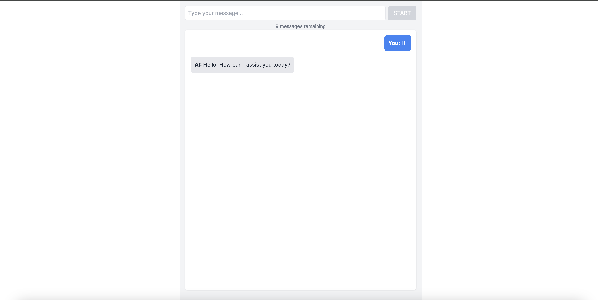

It is a [Next.js](https://nextjs.org/) project built on React and TailwindCSS.

## Getting Started

First, run the development server:

```bash
npm run dev
# or
yarn dev
# or
pnpm dev
# or
bun dev
```
API Token is saved in .env file.

Open [http://localhost:3000](http://localhost:3000) with your browser to see the result.

You can start editing the code in `src`. The page auto-updates as you edit the file.

Here is screenshots of my Application



